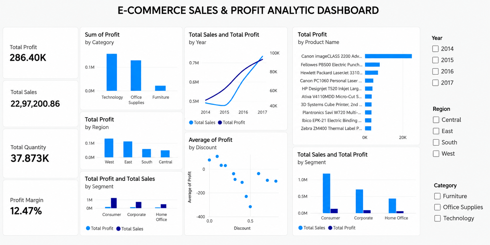

# E-Commerce Sales & Profit Analytics

## Project Overview

This project analyzes the Superstore e-commerce dataset to understand sales, profitability, customer segments, product performance, regional performance, and the relationship between discounts and profit.

## Objectives

- Analyze overall sales and profit performance
- Identify high- and low-performing categories, regions, products, and segments
- Analyze yearly sales and profit trends
- Examine the relationship between discount levels and average profit
- Build an interactive Power BI dashboard

## Dataset

**Dataset:** Sample Superstore  
**Rows:** 9,994  
**Columns:** 21

Key fields include Order Date, Ship Date, Segment, Region, Category, Product Name, Sales, Quantity, Discount, and Profit.

## Tools & Technologies

- Python
- Pandas
- NumPy
- Matplotlib
- SQL (SQLite)
- Power BI
- Google Colab
- GitHub

## Project Workflow

**CSV Dataset → Python/Pandas → SQL → Power BI**

## Analysis Performed

- Data cleaning and validation
- Missing-value and duplicate checks
- Date conversion and shipping-days calculation
- Sales, profit, quantity, and profit-margin analysis
- Category, region, segment, product, and shipping analysis
- Year-over-year sales and profit analysis
- Discount vs. average profit analysis
- SQL business analysis queries

## Key Metrics

- **Total Sales:** $2.297M
- **Total Profit:** $286.4K
- **Total Quantity:** 37,873
- **Profit Margin:** 12.47%

## Key Insights

- Technology generated the highest total profit among the categories.
- West region generated the highest total regional profit.
- Consumer segment contributed the highest total sales and profit.
- 2016 and 2017 showed strong sales and profit growth.
- Higher discount levels were generally associated with lower average profitability.
- Canon imageCLASS 2200 Advanced Copier was the highest-profit product.

## Power BI Dashboard

The interactive dashboard includes:

- KPI cards for Sales, Profit, Quantity, and Profit Margin
- Yearly Sales & Profit trend
- Profit by Category
- Profit by Region
- Top 10 Products by Profit
- Sales & Profit by Segment
- Discount vs. Average Profit analysis
- Year, Region, and Category slicers

## Project Files

- `E-Commerce_Sales_Analytics.ipynb` — Python and SQL analysis
- `E-Commerce_sales_analytics.pbix` — Power BI dashboard
- `power-bi-dashboard.png` — Dashboard preview
- `README.md` — Project documentation

## Business Takeaways

The analysis highlights differences in profitability across categories, regions, products, and customer segments. It also shows an association between higher discount levels and weaker average profitability, providing useful context for evaluating pricing and discount strategies.

## Author

**Data Analytics Portfolio Project**
